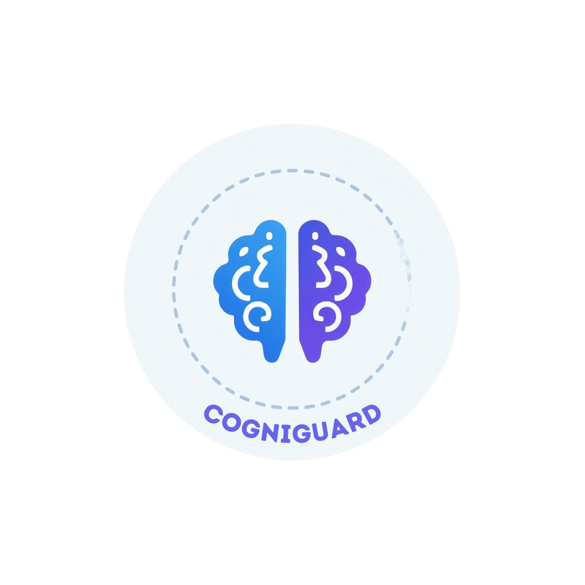

# Cogniguard 🧠

  

## What is Cogniguard?

Cogniguard is a cognitive overload detection system that analyzes EEG brain signals to identify mental fatigue. When it detects overload patterns, it provides timely alerts to help users take breaks before experiencing burnout.

## Why Cogniguard? 

In today's digital environment, we often work for extended periods without recognizing when our cognitive performance is declining. Cogniguard addresses this by:

- Providing objective measurement of mental fatigue
- Alerting users when they should take a break
- Tracking cognitive patterns over time to identify trends
- Creating a data-driven approach to managing mental workload

## Key Features

- EEG signal analysis for cognitive load detection
- Real-time monitoring via interactive dashboard
- Customizable alert thresholds
- Historical data visualization

This project aims to create technology that works with our cognitive limitations rather than against them. 